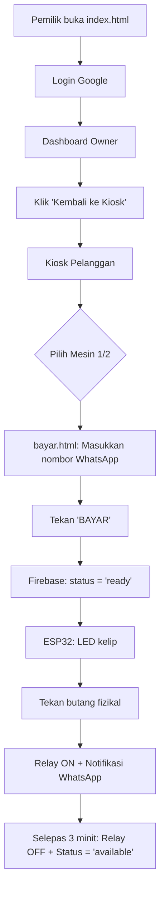

# 🧺 Smart Dobi DOBIABU – Sistem Dobi Layan Diri Pintar

> **Projek Akhir Tahun (FYP)**  
> Sistem dobi layan diri bersepadu dengan ESP32 S3, Firebase Realtime Database, dan notifikasi WhatsApp.

---

## 📌 Gambaran Keseluruhan

**DOBIABU** ialah sistem dobi layan diri moden yang membolehkan pengguna:
- Pilih mesin melalui antara muka web
- Bayar secara dalam talian
- Terima notifikasi WhatsApp secara automatik
- Gunakan mesin dengan butang fizikal

Sistem ini terdiri daripada:
- **Perkakasan**: ESP32 S3 dengan relay, LED, dan butang
- **Web Pelanggan**: Antara muka untuk pilih & bayar mesin
- **Dashboard Pemilik**: Pantau pendapatan & penggunaan secara masa nyata

---

## 🛠️ Ciri Utama

### 🔌 Perkakasan (ESP32 S3)
- 2 mesin aktif + 2 mesin dummy (ROSAK)
- Kawalan relay & LED berasaskan status Firebase
- Butang START fizikal
- Auto-notifikasi WhatsApp pada 3 peringkat:
  1. Mesin mula
  2. 5 minit sebelum siap
  3. Mesin siap

### 🌐 Web Pelanggan (`kiosk.html`)
- Reka bentuk **glassmorphism** moden
- Status mesin masa nyata dengan **timer countdown**
- Paparan **status ESP32** (✅ ONLINE / ❌ OFFLINE)
- Responsif untuk telefon & desktop

### 👔 Dashboard Pemilik (`owner.html`)
- Login Google (Firebase Authentication)
- Reka bentuk seperti **LaundryPOS** dengan sidebar kiri
- Statistik: Order Hari Ini, Pendapatan, Dalam Proses, Siap Diambil
- Graf pendapatan bulanan
- Senarai pesanan terkini
- Butang "Kembali ke Kiosk"

### 💬 Integrasi Pihak Ketiga
- **Firebase Realtime Database** – penyegerakan data masa nyata
- **WasapBot.my** – hantar notifikasi WhatsApp
- **GitHub Pages** – hos web tanpa kos

---

## ⚙️ Spesifikasi Teknikal

### Perkakasan
| Komponen | Pin ESP32 S3 |
|---------|--------------|
| Mesin 1 Button | GPIO 16 |
| Mesin 1 Relay  | GPIO 18 |
| Mesin 1 LED    | GPIO 13 |
| Mesin 2 Button | GPIO 17 |
| Mesin 2 Relay  | GPIO 21 |
| Mesin 2 LED    | GPIO 14 |

### Akaun & API
- **Firebase Project**: `smart-dobi-system-fyp`
- **WasapBot.my**:
  - Access Token: `695df3770b34a`
  - Instance ID: `6963E4965C6EB`
- **Wi-Fi Ujian**: 
  - SSID: `KaiserHelacio`
  - Password: `AlFAsih1111@`

### Struktur Data Firebase
```json
{
  "machines": {
    "1": { "status": "available", "whatsapp": "0189892155", ... }
  },
  "daily_records": {
    "2024-05-29": {
      "total_cycles": 3,
      "total_revenue": 13.00,
      "transactions": {
        "txn_a1b2c3d4...": { "machine": 1, "price": 5.00, ... }
      }
    }
  },
  "system": {
    "esp32_heartbeat": 1717020300000
  }
}
```

---

## 📂 Struktur Fail

```
smart-dobi-system/
├── SmartDobi_ESP32S3.ino     ← Kod utama ESP32
├── index.html                ← Halaman login owner
├── owner.html                ← Dashboard pemilik (gaya LaundryPOS)
├── kiosk.html                ← Kiosk pelanggan
├── bayar.html                ← Halaman pembayaran
└── page3.html                ← Arahan penggunaan
```

---

## 🚀 Cara Menyediakan

### 1. Persediaan Firebase
1. Pergi ke [Firebase Console](https://console.firebase.google.com/)
2. Buka projek `smart-dobi-system-fyp`
3. Aktifkan **Realtime Database** dalam **test mode**:
   ```json
   {
     "rules": {
       ".read": true,
       ".write": true
     }
   }
   ```
4. Aktifkan **Authentication → Google Sign-In**

### 2. Muatkan Kod ESP32
1. Buka `SmartDobi_ESP32S3.ino` di Arduino IDE
2. Gantikan `WIFI_SSID` & `WIFI_PASSWORD` jika perlu
3. Pilih board: **ESP32S3 Dev Module**
4. Muatkan kod ke papan

### 3. Deploy Web
1. Upload semua fail `.html` ke **GitHub Repository**
2. Aktifkan **GitHub Pages** (Settings → Pages → Branch: `main`)
3. Akses melalui: `https://<username>.github.io/smart-dobi-system/`

---

## 📊 Aliran Pengguna



---

## 🛡️ Penyelesaian Masalah

| Isu | Penyelesaian |
|-----|-------------|
| `exit status 1` | Kurangkan penggunaan `String`, guna `F()` macro |
| Wi-Fi disconnect | Matikan "Private Address" di iPhone hotspot |
| HTTP 405 | Pastikan Firebase dalam **test mode** |
| Web "loading" | Semak DevTools Console untuk ralat Firebase |
| Invalid JSON | Gunakan key selamat (`txn_xxx`), jangan guna nombor sahaja |

---

## 📚 Rujukan

- [Arduino Sketch Optimization](https://support.arduino.cc/hc/en-us/articles/360013825179)
- [Firebase Realtime Database Docs](https://firebase.google.com/docs/database)
- [WasapBot.my API](https://dash.wasapbot.my)

---

## 👨‍💻 Dibangunkan Oleh

**Dar Aqma Bin Rosli**  
📧 daraqmarosli@gmail.com  
📱 018-989 2155

> Projek Akhir Tahun – Sistem Dobi Pintar Bersepadu  
> © 2026 DOBIABU. Hak cipta terpelihara.
